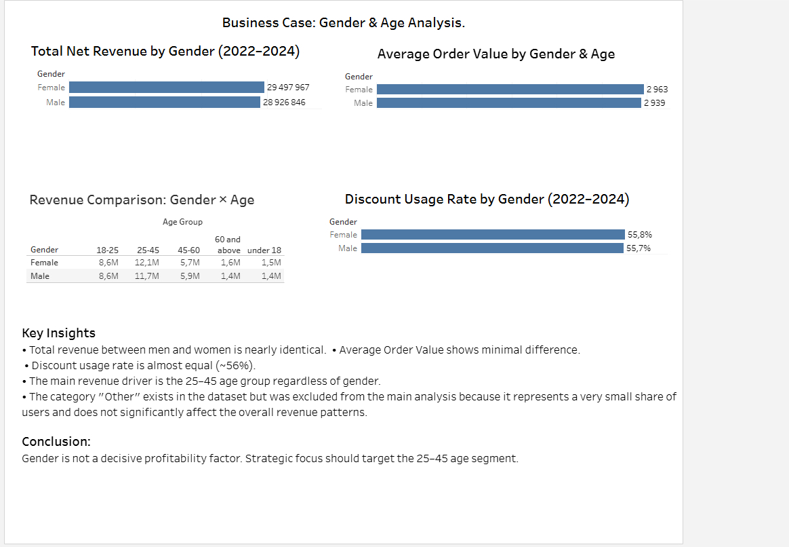
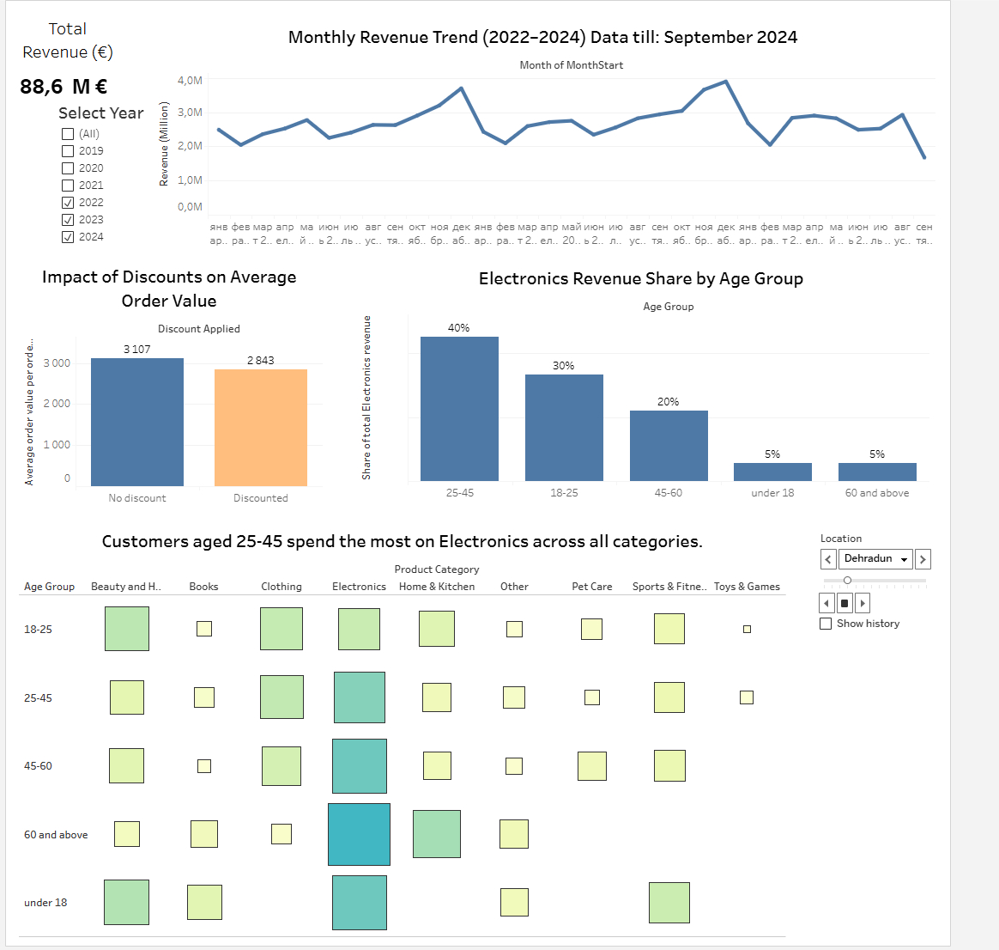

Built using the BigQuery public dataset: "thelook_ecommerce"

# E-commerce Customer Revenue Analysis

## 🇬🇧 Project Overview

End-to-end analysis of an e-commerce dataset using Python, SQL, Tableau and BigQuery.

## 🛠 Tools
Python, SQL, Tableau, BigQuery

## 📌 Business Questions

The analysis focuses on answering the following business questions:

- Which customer group (male or female) generates higher total revenue?
- Which group has a higher average order value (AOV)?
- Which group uses discounts more frequently?
- Which customer segment is the most profitable in the long term?

---

## 🧠 SQL Analysis

The analysis is based on 5 SQL queries executed on the public dataset:

`bigquery-public-data.thelook_ecommerce`

The queries include:
- Filtering users from Brazil registered in 2023
- Product category distribution analysis
- Joining orders and users tables (JOIN)
- Top 10 highest-value orders
- User distribution by country

---

## 📊 Data Visualization

An interactive Tableau dashboard was created to visualize key insights.

Main dashboard components:
- Monthly revenue trends
- Impact of discounts on average order value
- Revenue distribution by age group
- Product category performance
- Gender-based comparison

---

## 📈 Key Metrics

- Total Net Revenue
- Average Order Value (AOV)
- Discount Usage Rate
- Revenue by Age Group
- Gender × Age analysis

---

## 🔍 Key Insights

- Revenue from male and female customers is nearly equal
- Average order value differences are minimal
- Discount usage is similar (~56%)
- The most profitable segment is customers aged **25–45**
- Gender is not a decisive factor for revenue

---

## 💼 Business Conclusion

Customer gender is not a key profitability driver.

The most valuable segment is customers aged **25–45**, who consistently generate the highest revenue.

---

## 🚀 Recommendations

Marketing strategies should focus on **age segments rather than gender**.

Primary targeting should be customers aged **25–45**, as they represent the most profitable group.

---

## 📁 Repository Structure

ecommerce-customer-revenue-analysis/
│
├── screenshots/
│   ├── dashboard_overview.png
│   └── customer_segment_analysis.png
│
├── SQLqueries.sql/
│   ├── 1.pdf
│   ├── 2.pdf
│   ├── 3.pdf
│   ├── 4.pdf
│   ├── 5.pdf
│   ├── sql_task_1_users_brasil_2023.csv
│   ├── sql_task_2_categories_count.csv
│   ├── sql_task_3_shipped_orders.csv
│   ├── sql_task_4_top10_orders.csv
│   └── sql_task_5_users_by_country.csv
│
├── queries.sql
├── project1_df.csv
├── age_regression.py
├── tableau_public_link.txt
└── README.md

---
## Dashboard Preview

This dashboard highlights key business metrics such as revenue trends, customer segmentation and traffic sources.

### Revenue Overview


### Customer Segment Analysis


---
## 👤 Author

Larysa Marushchak  
Data Analytics & Engineering Student  
Deutsche Tech Akademie (DTA) 2026

---

## 🇺🇦 Опис проєкту

Цей проєкт присвячений аналізу поведінки клієнтів інтернет-магазину та оцінці факторів, що впливають на дохід компанії.

Основна мета аналізу — визначити, які сегменти клієнтів генерують найбільший дохід, та сформулювати рекомендації для маркетингової стратегії компанії.

## Dashboard Preview

### Revenue Overview


### Customer Segment Analysis


## Бізнес-завдання

У межах проєкту було проаналізовано клієнтські дані, щоб відповісти на такі бізнес-питання:

- Яка група клієнтів (чоловіки чи жінки) приносить більший загальний дохід?
- У якої групи вищий середній чек (Average Order Value)?
- Яка група клієнтів частіше купує товари зі знижками?
- Який сегмент клієнтів є найбільш вигідним для бізнесу в довгостроковій перспективі?

## Використані інструменти

У проєкті використовувалися такі інструменти:

- SQL (BigQuery)
- Tableau Public
- Python
- Excel (для попередньої обробки даних)
- GitHub (для організації та презентації проєкту)

## SQL-аналіз

Було виконано 5 SQL-запитів для аналізу даних із публічної бази:

`bigquery-public-data.thelook_ecommerce`

SQL-запити включають:

1. Пошук користувачів із Бразилії, які зареєструвалися у 2023 році
2. Аналіз кількості товарів у кожній категорії
3. Об’єднання таблиць замовлень і користувачів (JOIN)
4. Пошук 10 найдорожчих замовлень
5. Аналіз кількості користувачів у різних країнах

Файл із SQL-запитами:

queries.sql

Результати виконання SQL-запитів збережені у папці:

SQLqueries.sql

## Візуалізація даних

Для візуального аналізу було створено інтерактивний дашборд у Tableau.

Основні елементи дашборду:

- Динаміка місячного доходу компанії
- Вплив знижок на середній чек
- Частка доходу від різних вікових груп
- Аналіз витрат клієнтів за категоріями товарів
- Порівняння доходу між чоловіками та жінками

Посилання на Tableau Public: tableau_public_link.txt

## Основні метрики аналізу

У межах аналізу були досліджені такі показники:

-- Total Net Revenue
- Average Order Value (Net Amount / Gross Amount comparison)
- Discount Usage Rate
- Revenue by Age Group
- Gender × Age comparison

## Основні інсайти

Аналіз даних показав такі результати:

- Загальний дохід від чоловіків та жінок є майже однаковим.
- Середній чек відрізняється незначно.
- Частка покупок зі знижками також майже однакова (близько 56%).
- Найбільший внесок у дохід компанії формує вікова група **25–45 років** незалежно від статі клієнтів.
- Категорія клієнтів **"Other"** присутня у даних, але була виключена з основного аналізу через дуже малу частку користувачів.
- Порівняння Net Amount та Gross Amount показало, що різниця між групами клієнтів є незначною і не впливає суттєво на загальні висновки аналізу.

## Бізнес-висновок

Стать клієнта не є визначальним фактором прибутковості.

Найбільш прибутковим сегментом для компанії є клієнти віком **25–45 років**, які стабільно генерують найбільший дохід.

## Рекомендації для бізнесу

Маркетингові стратегії доцільно оптимізувати не за статтю клієнтів, а за віковими сегментами.

Основний фокус маркетингових кампаній варто спрямувати на клієнтів віком **25–45 років**, оскільки саме цей сегмент формує найбільшу частку доходу компанії.

## Структура репозиторію

```
ecommerce-customer-revenue-analysis/
│
├── screenshots/
│   ├── dashboard_overview.png
│   └── customer_segment_analysis.png
│
├── SQLqueries.sql/
│   ├── 1.pdf
│   ├── 2.pdf
│   ├── 3.pdf
│   ├── 4.pdf
│   ├── 5.pdf
│   ├── sql_task_1_users_brasil_2023.csv
│   ├── sql_task_2_categories_count.csv
│   ├── sql_task_3_shipped_orders.csv
│   ├── sql_task_4_top10_orders.csv
│   └── sql_task_5_users_by_country.csv
│
├── queries.sql
├── project1_df.csv
├── age_regression.py
├── tableau_public_link.txt
└── README.md
```
## Автор

Лариса Марущак  
Студентка програми **Data Analytics & Engineering**  
DTA – Deutsche Tech Akademie  
Група: **25-GR-01**  
Lex Labs UG (VAT DE 356810365)

Навчальний аналітичний проєкт з аналізу клієнтської поведінки та сегментації користувачі
